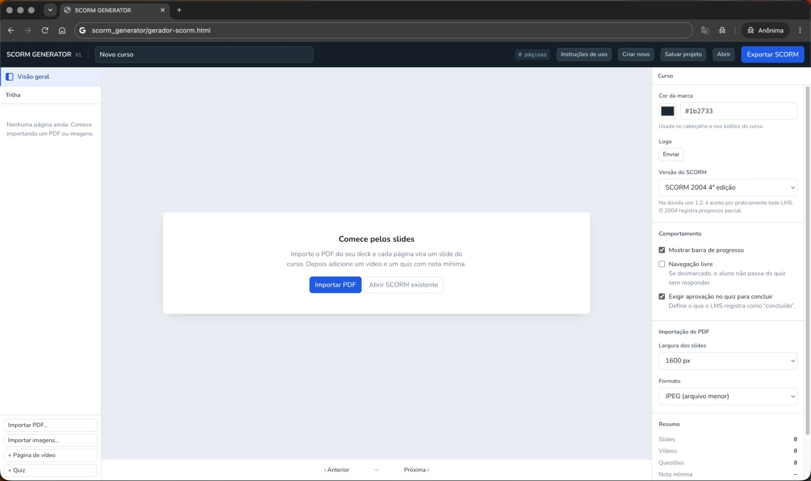
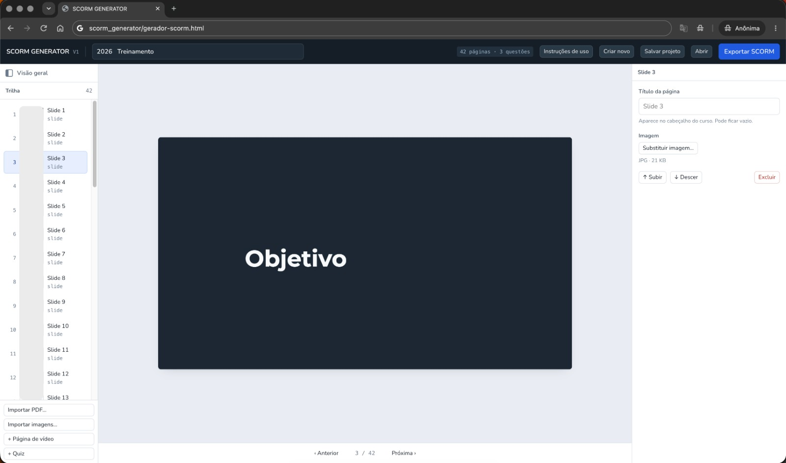
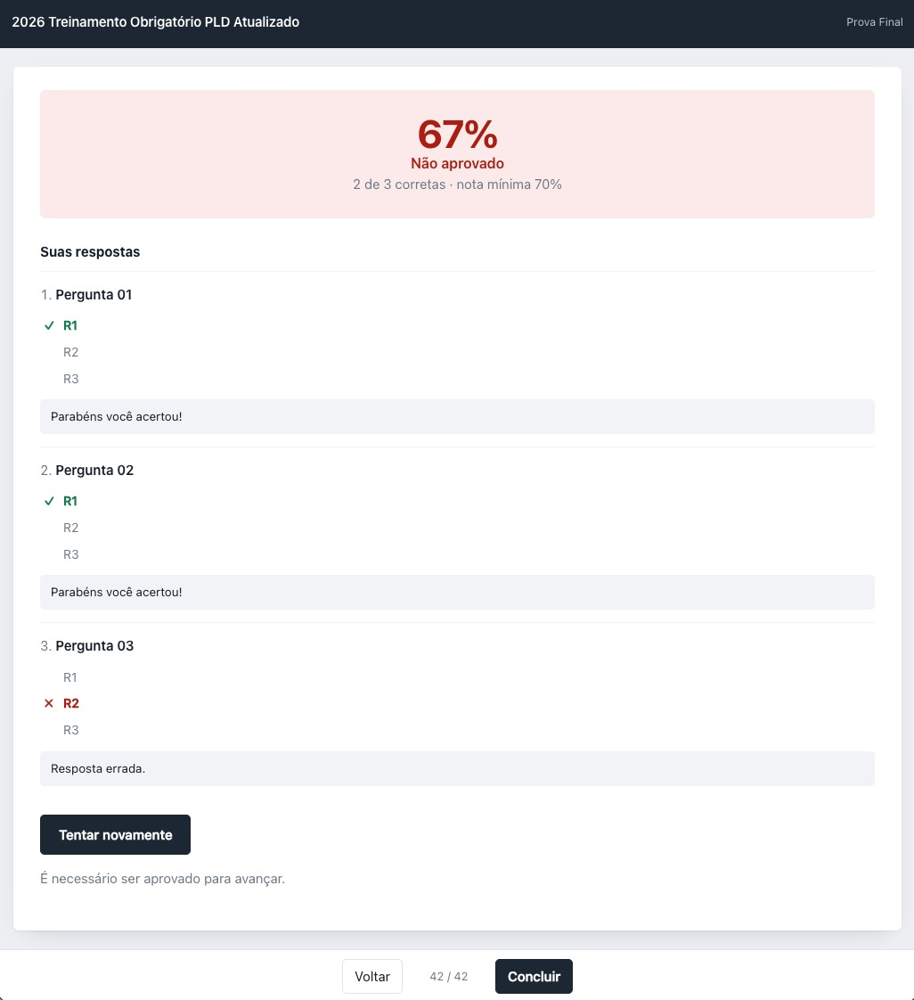
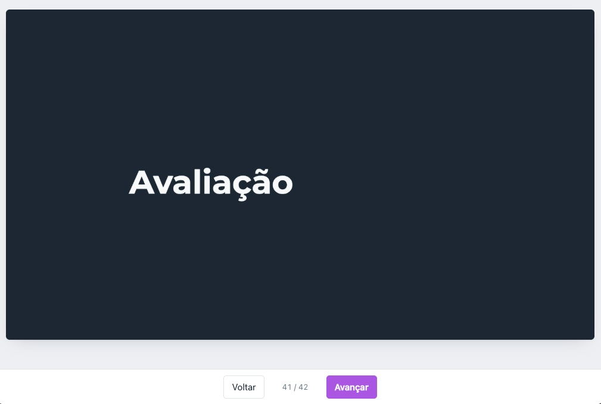

# SCORM GENERATOR

Crie cursos SCORM a partir de um PDF, sem conhecimento técnico e sem instalar nada.

Entra o PDF da sua apresentação, sai um `.zip` pronto para subir no LMS, com vídeo,
quiz, nota mínima e registro de progresso. Tudo roda dentro do navegador: nenhum
arquivo seu sai do computador e não é preciso internet.



## Capturas de tela

| Editor | Tela inicial |
|---|---|
|  |  |

| Quiz no curso exportado | Curso em produção |
|---|---|
|  |  |

## Sumário

- [O que é isso](#o-que-é-isso)
- [Começando](#começando)
- [O fluxo de trabalho](#o-fluxo-de-trabalho)
- [SCORM 1.2 ou 2004](#scorm-12-ou-2004)
- [Salvar e continuar depois](#salvar-e-continuar-depois)
- [Problemas comuns](#problemas-comuns)
- [Estrutura do projeto](#estrutura-do-projeto)
- [Decisões técnicas](#decisões-técnicas)
- [Dependências, zero rede](#dependências-zero-rede)
- [Como verificar depois de mexer](#como-verificar-depois-de-mexer)
- [Licenças](#licenças)

## O que é isso

**SCORM** é um formato de arquivo que plataformas de treinamento sabem abrir, do
mesmo jeito que o Word abre `.docx`. A plataforma costuma ser chamada de **LMS**, e o
SCORM GENERATOR monta esse arquivo para você.

Foi desenvolvido para a **KnowBe4**, mas deve funcionar com qualquer plataforma que
aceite o formato SCORM.

**O que ele faz:**

- Converte cada página de um PDF em um slide do curso
- Aceita imagens soltas (PNG, JPG) como slides
- Página de vídeo, por arquivo MP4 dentro do pacote ou por link do YouTube e Vimeo
- Travas de vídeo: exigir assistir até o fim e impedir avançar a barra
- Quiz com múltipla escolha, nota mínima, feedback por questão, sorteio da ordem,
  nova tentativa e revisão das respostas
- Cor da marca, logo, barra de progresso e regras de navegação
- Exporta em SCORM 1.2 ou SCORM 2004 4ª edição
- Reabre um `.zip` que ele mesmo gerou e devolve tudo para edição
- Salva o trabalho em um arquivo `.json` de projeto

**O que ele não faz:** não é um editor de slides. O conteúdo visual vem pronto do
PowerPoint, do Google Slides ou de onde você preferir.

## Começando

Não tem build, não tem instalação, não tem dependência para baixar.

1. Baixe ou clone o repositório
2. Abra `gerador-scorm.html` no navegador, duplo clique já serve
3. Clique em **Importar PDF…**

> [!IMPORTANT]
> Mantenha a pasta inteira junta. O `gerador-scorm.html` precisa das pastas `css` e
> `js` que ficam ao lado dele. Copiar só o arquivo `.html` para outro lugar abre a
> ferramenta sem estilo e sem funcionar.

**Rodando por HTTP (opcional):**

```bash
python3 -m http.server
# depois abra http://localhost:8000/gerador-scorm.html
```

Serve para duas coisas: a prévia de vídeo por link funciona (o YouTube recusa prévias
em `file://`) e a conversão de PDF roda fora da thread da tela, sem congelar a
interface. Para o uso normal, o duplo clique basta.

O guia completo para quem vai operar a ferramenta está em
[`como-usar.html`](como-usar.html), acessível pelo botão **Como usar** na barra
superior.

## O fluxo de trabalho

O caminho é curto: **importa o PDF, ajusta, põe um vídeo e um quiz, exporta.**

A tela tem três colunas: a **Trilha** à esquerda (a lista de páginas na ordem em que o
aluno vai ver), o **palco** no meio (prévia da página selecionada) e o **Inspetor** à
direita (onde você edita).

### 1. Trazer o conteúdo

Os botões de importar ficam embaixo da Trilha. **Importar PDF…** converte cada página
em um slide. **Importar imagens…** aceita várias de uma vez, na ordem do nome do
arquivo. E em **Visão geral**, **Abrir pacote SCORM existente…** lê um `.zip` gerado
pela ferramenta e devolve slides, quiz, cores, logo e até o vídeo em MP4.

Se o texto sair borrado, ajuste a largura dos slides (1280, 1600 ou 2000 px) e o
formato em **Visão geral → Importação de PDF**. PNG deixa o texto mais nítido, JPEG
deixa o arquivo menor. Escolha antes de importar, a conversão usa o que estiver
marcado no momento.

> [!NOTE]
> Importar sempre acrescenta no fim da Trilha. Para trocar um slide só, use
> **Substituir imagem…** no Inspetor, que preserva posição, título e o resto do curso.

### 2. Mexer nos slides

Reordene arrastando na Trilha ou pelos botões **↑ Subir** e **↓ Descer**. O título da
página é opcional e aparece discreto no cabeçalho do curso.

### 3. Colocar um vídeo

**+ Página de vídeo** entra logo depois da página selecionada. No Inspetor você escolhe
de onde vem o vídeo, e essa escolha muda bastante coisa:

| | MP4 no pacote | Link do YouTube ou Vimeo |
|---|---|---|
| Internet para o aluno | não precisa | precisa |
| Tamanho do `.zip` | grande | mínimo |
| Anúncio e rastreamento | não | possível |
| Travas de assistir | disponíveis | não existem |

Muitos LMS recusam upload acima de 100 a 250 MB, e a ferramenta avisa quando o arquivo
passa de 100 MB.

> [!WARNING]
> Para travar de verdade, marque as duas opções. **Impedir avançar a barra** sozinha
> não segura o aluno, ela só entra em ação junto com **Exigir assistir até o fim**.

### 4. Montar o quiz

**+ Quiz** entra no fim da Trilha. É um quiz por curso.

Cada questão precisa de enunciado, no mínimo duas alternativas e exatamente uma
correta. A etiqueta na barrinha mostra `ok` quando está completa e `!` quando falta
algo. Enquanto houver `!`, a exportação fica travada, então é uma lista de pendências.

As cinco regras do quiz: permitir nova tentativa, bloquear avanço enquanto reprovado,
sortear a ordem das questões, mostrar revisão das respostas e revelar a alternativa
correta. A última só funciona junto com a revisão.

### 5. A cara e as regras do curso

Em **Visão geral**: cor da marca, logo, versão do SCORM, barra de progresso, navegação
livre e se a aprovação no quiz é exigida para concluir.

> [!WARNING]
> **Navegação livre desliga todas as travas**, tanto a do vídeo quanto a do quiz.

### 6. Gerar o arquivo

**Exportar SCORM** abre um check-up do curso: ✓ verde está certo, ! amarelo é só aviso,
✗ vermelho trava a exportação. Resolvido isso, **Gerar .zip** baixa o arquivo com um
nome tipo `treinamento-obrigatorio-pld-scorm2004.zip`.

Esse é o arquivo que você sobe no LMS, e não deve ser descompactado.

Abrindo o `index.html` de dentro do zip no seu computador, o curso roda mas mostra o
aviso `fora do LMS · sem registro`. Isso está correto: sem uma plataforma para
conversar, não há onde gravar a nota.

> [!TIP]
> Teste no [SCORM Cloud](https://cloud.scorm.com) antes de publicar. A conta gratuita
> roda o pacote como um LMS de verdade, e você confere se a nota chega, se o progresso
> registra e se as travas funcionam.

## SCORM 1.2 ou 2004

É a única escolha que depende da plataforma da sua empresa, e não do seu gosto:

- **SCORM 1.2**, aceito por praticamente todo LMS. Na dúvida, use este.
- **SCORM 2004 4ª edição**, registra progresso parcial (o LMS mostra "60% do curso"),
  mas nem toda plataforma aceita.

Se não souber qual, exporte os dois e teste.

## Salvar e continuar depois

**Não existe salvamento automático.** Tudo acontece no navegador, e fechar a aba perde
o trabalho. Clique em **Salvar projeto** de vez em quando: ele baixa um `.json` com
tudo dentro, e **Abrir** traz esse arquivo de volta depois.

Guarde esse `.json` em um lugar que você lembre. Ele é o seu arquivo de trabalho, o
equivalente ao `.pptx` de uma apresentação. O `.zip` é só o produto final.

> [!NOTE]
> A exceção é o vídeo em MP4. O arquivo não entra no `.json`, porque um vídeo de 40 MB
> deixaria o projeto gigante. Guarde o MP4 na mesma pasta do `.json`: ao reabrir, a
> ferramenta avisa quais vídeos faltam e você anexa de novo com um clique. Vídeo por
> link não tem esse problema.

## Problemas comuns

<details>
<summary><strong>Não consigo importar o PDF</strong></summary>

Se o aviso diz que o **pdf.js não carregou**, é a pasta: confira se `js` e `css` estão
ao lado do `gerador-scorm.html`. Não é problema de internet, a aplicação não usa rede.

Se a conversão de um PDF grande parece travada, é esperado no modo duplo clique, em que
ela roda na mesma thread da tela. Espere, o contador de páginas volta a andar. Servir a
pasta por HTTP resolve.

Em último caso, exporte os slides como imagem no PowerPoint e use **Importar imagens…**.
</details>

<details>
<summary><strong>O botão Gerar .zip está apagado</strong></summary>

Tem item ✗ vermelho na lista. Os mais comuns: questão sem enunciado, alternativa em
branco, duas corretas marcadas na mesma questão, ou uma página de vídeo sem arquivo nem
link.
</details>

<details>
<summary><strong>O LMS recusou o arquivo por tamanho</strong></summary>

Quase sempre é o MP4. Duas saídas: comprimir o vídeo antes, ou trocar para vídeo por
link. A lista de exportação mostra o tamanho total da mídia.
</details>

<details>
<summary><strong>A prévia do vídeo por link aparece em branco, ou com erro 153</strong></summary>

Normal, e não é problema do seu curso. Acontece porque a ferramenta foi aberta com
duplo clique, e o YouTube recusa prévias nessa situação. Dentro do LMS funciona.
</details>

<details>
<summary><strong>Fechei a aba e perdi tudo</strong></summary>

Se você já tinha exportado o `.zip` alguma vez, dá para recuperar: **Visão geral →
Abrir pacote SCORM existente…** reconstrói o curso a partir dele.
</details>

<details>
<summary><strong>A nota do aluno não apareceu no sistema</strong></summary>

Confira em **Visão geral** se **Exigir aprovação no quiz para concluir** está do jeito
que você quer, e se a versão do SCORM é a que sua plataforma aceita. Rode o mesmo
pacote no SCORM Cloud: se a nota chega lá e não chega no seu LMS, o problema está na
configuração da plataforma.
</details>

> [!NOTE]
> As travas de vídeo e quiz existem para **organizar o percurso**, não para segurar
> quem realmente queira burlar, já que rodam no navegador do aluno. Para treinamento
> obrigatório isso é mais que suficiente, só não conte com elas como controle de
> segurança.

## Estrutura do projeto

```
scorm_generator/
  gerador-scorm.html     marcação, os 4 templates do pacote e a ordem dos scripts
  como-usar.html         guia de uso, para quem vai operar a ferramenta
  css/
    nunito.css           a fonte, embutida como data: URI (zero rede)
    nunito-OFL.txt       licença da fonte
    bancada.css          estilo da interface (não vai no pacote)
    como-usar.css        estilo de documento do guia de uso
  js/
    state.js             S (estado) e as fábricas de página e questão
    utils.js             helpers: dom, escape, toast, slug, arquivos, toEmbed
    track.js             painel da trilha (esquerda)
    stage.js             painel do palco (centro)
    inspector.js         inspetor: roteador, bind, moveBlock, wireMove
    inspector-course.js  inspetor: painel "Visão geral"
    inspector-slide.js   inspetor: slide
    inspector-video.js   inspetor: vídeo e anexo do MP4
    inspector-quiz.js    inspetor: quiz e editor de questões
    importers.js         entrada: PDF, imagens e .zip existente
    project.js           salvar, abrir e zerar o projeto .json
    exporter.js          validar, montar course-data, manifest e gerar o .zip
    app.js               renderAll, init e boot
    vendor/              JSZip e pdf.js, versionados junto (zero CDN)
      LEIA-ME.md         procedência, versões, sha256 e licenças
```

`state.js` é a única fonte de verdade: `S` guarda o curso inteiro, ninguém mantém
cópia, e todos chamam `renderAll()` depois de escrever.

Ao mudar um rótulo de botão na interface, **ajuste o `como-usar.html` também**. Ele
cita 43 nomes de campos e botões.

## Decisões técnicas

### Os templates do pacote ficam dentro do HTML

Os quatro blocos `<script type="text/plain">` (`#tpl-index`, `#tpl-css`, `#tpl-player`,
`#tpl-scorm`) guardam os arquivos que vão **dentro do `.zip`** exportado. Eles não foram
movidos para arquivos soltos de propósito:

- um `<script>` de tipo desconhecido ignora o atributo `src`, então não há como
  carregá-los por `src`
- buscá-los com `fetch()` quebraria a ferramenta aberta em `file://`, que é o modo de
  uso principal
- transformá-los em strings de JS exigiria re-escapar `✓`, barras invertidas de regex e
  afins, com risco de corromper silenciosamente o pacote gerado

`tpl()` (em `exporter.js`) lê o `textContent` desses blocos. Ao editar um deles, vale a
regra: **nenhum pode conter a tag literal de fechamento de script**, senão o navegador
encerra o bloco no meio.

### Scripts clássicos, não módulos ES

Os 13 arquivos de `js/` são scripts clássicos compartilhando o escopo global, na ordem
de dependência declarada no fim do HTML. `type="module"` exigiria HTTP e quebraria o
duplo clique.

A ordem importa em um ponto: `state.js` declara `S` no momento em que carrega e todos
dependem dele, e `app.js` vem por último porque chama `init()` na hora. Entre os demais,
a ordem é só organização, já que são todas declarações de função, içadas antes de
qualquer evento disparar.

### A fonte é data: URI

Nunito v32 (variável, peso 200 a 1000) está embutida em `css/nunito.css` como `data:`
URI, e não vem do Google Fonts. Um arquivo de fonte referenciado por `url()` passa por
checagem de CORS, e em uma página aberta por duplo clique (`file://`) a origem é `null`,
então o navegador recusaria o arquivo local. A interface cairia para a fonte do sistema
justamente no modo de uso principal, e `data:` URI não passa por CORS.

Só os subsets `latin` e `latin-ext` entram, cerca de 100 KB.

**O curso exportado não usa Nunito.** O template `#tpl-css` segue com a fonte do
sistema, para o pacote continuar autocontido e sem nenhuma requisição externa, requisito
de um curso que roda dentro do LMS, possivelmente em rede fechada.

### O worker do pdf.js

`pdf.worker.min.js` não entra na lista de `<script>` do HTML. Quem o carrega é o próprio
pdf.js, na primeira importação de PDF, a partir do caminho que `setupPdfWorker()`
([js/importers.js](js/importers.js)) põe em `GlobalWorkerOptions.workerSrc`. Assim 1 MB
não é lido a cada abertura.

Isso funciona nos dois modos de uso porque o pdf.js tem plano B próprio:

- **servido por HTTP**, `new Worker()` funciona, a rasterização roda fora da thread da
  interface e a tela continua respondendo
- **aberto por duplo clique (`file://`)**, `new Worker()` é recusado (origem `null`), o
  `catch` do pdf.js cai em `_setupFakeWorker()`, que carrega o mesmo arquivo por
  `<script src>`, e script tag não sofre a restrição. Funciona, mas na thread da
  interface, então a tela congela durante a conversão.

## Dependências, zero rede

**Nada aqui faz requisição externa.** Nem a ferramenta, nem o guia de uso, nem o pacote
gerado. As bibliotecas estão versionadas junto com o projeto:

| Arquivo | Versão | Uso | Licença |
|---|---|---|---|
| `js/vendor/jszip.min.js` | 3.10.1 | monta e lê arquivos `.zip` | MIT / GPLv3 |
| `js/vendor/pdf.min.js` | 3.11.174 | API do pdf.js | Apache 2.0 |
| `js/vendor/pdf.worker.min.js` | 3.11.174 | rasteriza as páginas do PDF | Apache 2.0 |
| `css/nunito.css` | Nunito v32 | fonte da interface | OFL 1.1 |

Procedência, sha256 e como atualizar: [js/vendor/LEIA-ME.md](js/vendor/LEIA-ME.md).

> [!IMPORTANT]
> Ao trocar a versão do pdf.js, troque `pdf.min.js` e `pdf.worker.min.js` de uma vez.
> Precisam ser da mesma versão, senão a conversão falha de um jeito difícil de
> diagnosticar.

## Como verificar depois de mexer

1. Servir a pasta (`python3 -m http.server`) e abrir por HTTP, necessário para a prévia
   de vídeo por link
2. Importar um PDF, adicionar vídeo e quiz, exportar nas duas versões de SCORM
3. Descompactar o `.zip`, servir a pasta e abrir o `index.html`: deve rodar com o badge
   "fora do LMS", navegação e quiz funcionando
4. Round-trip: reabrir o `.zip` que a própria ferramenta gerou e conferir que slides,
   quiz, cores, logo e MP4 voltam
5. Registro real: subir no SCORM Cloud e conferir progresso, nota e conclusão
